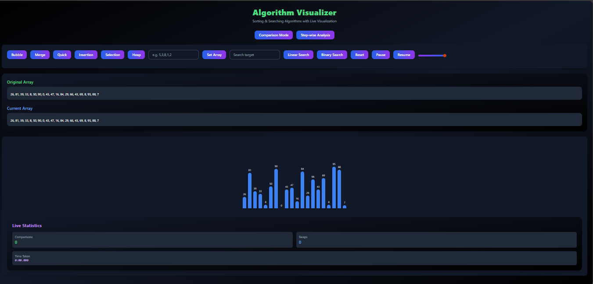
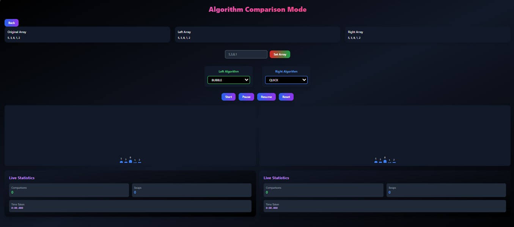
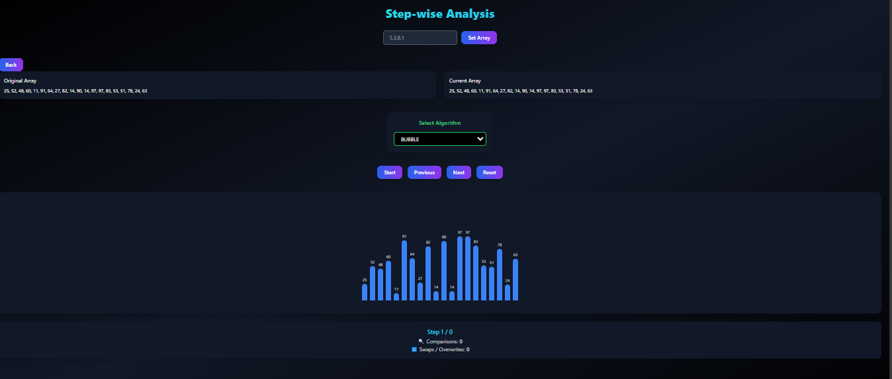

# 📊 Algorithm Visualizer (DSA Learning Tool)

An **interactive Algorithm Visualizer** built using **React.js** to help students and developers understand and analyze **sorting** and **searching algorithms** through **step-by-step visual animations**, comparisons, and swaps tracking.

This project is designed for **DSA learning**, **interview preparation**, and **educational purposes**.

---

## 🚀 Features

### 🔹 Sorting Algorithms
- Bubble Sort  
- Selection Sort  
- Insertion Sort  
- Merge Sort  
- Quick Sort  
- Heap Sort  

### 🔹 Searching Algorithms
- Linear Search  
- Binary Search  
⚠️ **Shows warning if array is not sorted** (educational constraint)

---

## 🎯 Core Highlights
- 📌 Step-by-step execution of algorithms  
- 📊 Real-time tracking of comparisons & swaps  
- 🎥 Animated bar visualization for arrays  
- 🔁 Next / Previous step navigation  
- 📐 Dynamic array generation  
- 🧠 Algorithm time complexity reference  
- 📱 Responsive & clean UI (Tailwind CSS)  

---

## 🛠️ Tech Stack
- **Frontend:** React.js  
- **Styling:** Tailwind CSS  
- **State Management:** React Hooks & Context API  
- **Algorithms:** Custom JavaScript implementations  
- **Tooling:** ESLint, Create React App  

---

## 📂 Project Structure
src/
│── algorithms/ # Sorting & searching logic
│── components/ # Reusable UI components
│── pages/ # Visualizer, Step Analysis, Comparison
│── context/ # Global visualizer state
│── hooks/ # Custom hooks for steps & control
│── utils/ # Helper functions

yaml
Copy code

---

## 📸 Screenshots

Here are some screenshots of the project in action:

### 🏠 Home Page


### 📊 Comparison Page


### 🎯 Step Analysis Page


---

## 💡 Notes
- Binary Search works **only on sorted arrays**  
- Warning is displayed if array is unsorted (educational purpose)  
- Designed to help **visualize, learn, and debug DSA algorithms**

---

## 📌 Deployment / Usage
1. Clone the repository  
```bash
git clone <repo-link>
Install dependencies

bash
Copy code
npm install
Run the project

bash
Copy code
npm start
Open http://localhost:3000 in your browser
